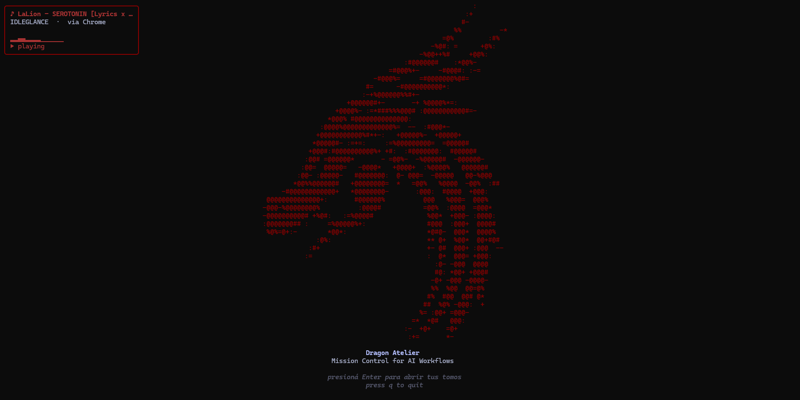

# Dragon Atelier



> **Mission Control for AI-assisted development.** A keyboard-driven terminal cockpit for everyone juggling multiple projects across Claude Code — written in Go with [Bubble Tea](https://github.com/charmbracelet/bubbletea).

[](https://github.com/GastonZ/Atelier/actions/workflows/ci.yml)
[](https://goreportcard.com/report/github.com/gastonz/atelier)

---

## Why

If you run AI-assisted workflows all day, your projects, your Claude sessions, your memory store and your costs live in a dozen different places. Dragon Atelier pulls them into a single terminal dashboard you drive entirely from the keyboard — no mouse, no browser tabs, no context-switching.

It's the cockpit I use every day to jump between repos, watch live agent sessions, and keep an eye on what they cost.

## Features

Everything below is built and working today — not a roadmap.

### 📚 Project registry ("Tomos")
Register every project once and launch it instantly. The list shows a live **git status indicator** per repo (clean / modified / untracked) and supports fuzzy `/` search.

Per-project actions:
- **Launch any AI coding agent** — Claude Code, Codex, Gemini and more, each in the project directory. The launcher list is **configurable** (see [Configuration](#configuration)); uninstalled CLIs are marked `(no instalado)`.
- **Open in VS Code**
- **Open a PowerShell** rooted at the project
- **Copy the path** to the clipboard
- Jump straight into the project's **memory**, **history**, or **disk** views

### 🛰️ Agent Monitor — the war room
A live tile grid of your active Claude Code sessions, refreshed by a filesystem watcher:
- **Real-time USD cost telemetry** per session, computed from token usage
- **Sub-agent grouping** — expand/collapse the agents a session spawned
- **Zoom** into any tile for detail, and **step-by-step replay** of a session's events with pause and variable playback speed

### 🧠 Engram memory browser
Browse and fuzzy-search the persistent AI memory (Engram) for the selected project, then open any observation in a scrollable detail pane. Reads the local Engram SQLite store directly.

### 🕓 Unified project history
A single timeline that merges **git commits** and **SDD (Spec-Driven Development) archives** for a project, newest first. Drill into any entry to see the full `git show` diff or the archived change document.

### 💾 Disk usage
A breakdown of what your AI tooling is costing you on disk: the Engram database, the total `~/.claude/projects` footprint, and a per-project tally. Hit `Enter` on any row to open it in your file explorer.

### 🎵 Now playing & live audio visualizer
An ambient card on the welcome screen showing the track currently playing on your system — title, artist and source — read from the Windows **System Media Transport Controls** (the same source that powers the OS media flyout), so Spotify and browser audio are reported uniformly. Beside it, a **real-time waveform** driven by **WASAPI loopback capture + FFT**: the bars react to the actual sound coming out of your speakers, in dragon colours. Pure Go, no CGO.

### 🐉 Crafted, degradation-aware UI
Catppuccin Mocha palette with custom dragon-brand accents, and a graceful text-only fallback when the terminal is too small for the full art.

## Keybindings

| Screen | Keys |
|--------|------|
| **Welcome** | `Enter` projects · `a` agent monitor · `l` launcher manager · `q` quit |
| **Launcher manager** | `j/k` navigate · `a` add · `e` edit · `d` delete · `J/K` reorder · `esc` back |
| **Projects** | `↑/↓` `j/k` navigate · `/` search · `Enter` actions · `n` new · `d` delete · `r` refresh git status · `m` monitor · `esc` back |
| **Project actions** | `j/k` navigate · `Enter` run · `esc` back |
| **Agent monitor** | `j/k` navigate · `1–9` jump · `o/c` expand/collapse sub-agents · `Enter` zoom · `esc` back |
| **Agent zoom** | `r` replay · `esc` back |
| **Replay** | `space` pause/resume · `+/-` speed · `>/<` step · `esc` back |
| **Memory / History** | `j/k` navigate · `/` filter · `Enter` open detail · `esc` back |
| **Disk usage** | `j/k` navigate · `Enter` open in explorer · `esc` back |

`Ctrl+C` quits from anywhere.

## Architecture

A deliberately simple, testable design:

- **Single `Model`, value semantics.** All application state lives in one struct; every `Update` branch returns a *new* `Model` (immutable updates), which keeps state transitions easy to reason about and to test.
- **Screen state machine.** A `Screen` enum drives `Update` and `View`; each screen has its own key handler and renderer.
- **Dependency injection at the boundary.** Registry, launchers, clipboard, the transcript scanner/watcher, the Engram client and git readers are all interfaces injected in `main`, with fakes in tests — the TUI never touches the OS directly.
- **Nil-safe degradation.** A missing Engram DB or absent `git` doesn't crash the app; the relevant screen surfaces a friendly message instead.

```
cmd/atelier/         entry point + dependency wiring
internal/
  tui/               Bubble Tea model, update, view, per-screen key handlers
  registry/          project store (the "Tomos")
  actions/           launchers: Claude Code, VS Code, PowerShell, clipboard
  transcripts/       Claude session parser, cost pricing, fs watcher, replay
  engram/            Engram SQLite client + observation types
  git/               status / log / show readers
  disk/              usage walker + explorer integration
  nowplaying/        SMTC now-playing provider (Windows) + parsing
  audio/             WASAPI loopback capture + FFT spectrum analysis
  config/            atelier + app config
```

Test coverage spans unit tests, mocked-dependency tests, and golden snapshot tests of the rendered TUI.

## Configuration

> **Manage launchers without leaving the TUI.** Press `l` on the welcome screen to
> open the launcher manager — add, edit, delete and reorder agent launchers right
> there. Changes are saved to `~/.atelier/config.yaml` for you, so you never have
> to find or hand-edit a config file. The YAML below is just what it writes.

Dragon Atelier reads optional settings from `~/.atelier/config.yaml`. The file is
entirely optional — every key falls back to a sensible default.

```yaml
# How recent (minutes) a session's last activity must be to count as "active".
active_window_minutes: 15
# Fallback polling interval (ms) for the agent monitor.
polling_interval_ms: 500

# Agent launchers shown at the top of the per-project actions menu. Each entry is
# spawned, detached, in the project directory. Omit this key to keep the defaults
# (Claude Code, Codex, Gemini); set it to fully customise; set it to [] to clear.
launchers:
  - { label: "Claude Code", command: "claude" }
  - { label: "Codex",       command: "codex" }
  - { label: "Gemini",      command: "gemini" }
  - { label: "Aider",       command: "aider", args: ["--no-auto-commits"] }
```

`command` is resolved on your `PATH`; `args` (optional) are passed verbatim after
it, so CLIs that need a subcommand or flag just work. Adding a new tool is a YAML
edit — no rebuild.

## Install

### Download (recommended)

Grab the latest prebuilt binary from the [**Releases**](https://github.com/GastonZ/Atelier/releases/latest) page — no Go toolchain required:

1. Download `dragon_atelier-windows-amd64.exe` (Windows). Linux/macOS builds are attached too.
2. Double-click it, or run it from a terminal.

That's it. On first launch the project registry is empty — press `n` to add your projects.

> **Prerequisites for the full experience:** the launchers and agent monitor expect [Claude Code](https://claude.com/claude-code) installed and `~/.claude/projects` present. Without it the app still runs; those panels just show empty. The Engram memory browser is optional too (nil-safe when `~/.engram` is absent).

### Build from source

Prerequisites: Go 1.25+ and (optionally) the [Task](https://taskfile.dev) runner.

```sh
git clone https://github.com/GastonZ/Atelier.git
cd Atelier
task build          # or: go build -o dragon_atelier ./cmd/atelier
```

## Run

```sh
./dragon_atelier           # Linux / macOS
./dragon_atelier.exe       # Windows

dragon_atelier version     # print version and exit
dragon_atelier help        # usage
```

> Terminals smaller than ~100×48 show a text-only fallback. Resize for the full dragon.

## Status

Active personal project, used daily. The `.goreleaser.yaml` is provisional and will be validated before the first `v0.1.0` tag.

## License

[MIT](LICENSE) — Copyright 2026 Gaston Zappulla
